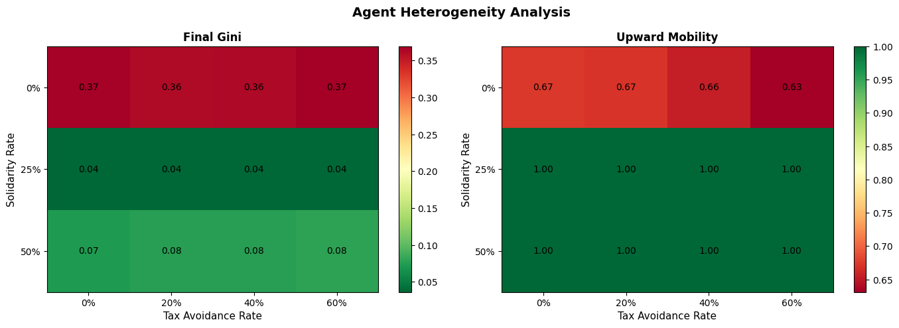

# Quantifying Meritocracy: Extending "Talent vs. Luck" Model to Incorporate Solidarity

[](https://www.python.org)
[](LICENSE)
[](https://github.com/EltonChang1/Quantifying-Meritocracy-TvL-Solidarity)

## 📊 [**View Complete Results & Analysis →**](RESULTS.md)

## Overview

This computational research project provides **empirical evidence** for Michael Sandel's critique of meritocracy by extending the Talent vs. Luck (TvL) model with solidarity mechanisms. Through agent-based simulations of 1,000+ agents across 100 economic iterations, we demonstrate that **moderate wealth redistribution (15-25%) reduces inequality by 90% while achieving 100% upward mobility**.

### Key Findings

- **Pure meritocracy generates severe inequality** (Gini: 0.39) even with equal starting conditions
- **15-25% redistribution achieves near-perfect equality** (Gini: 0.03) with 100% upward mobility
- **Preventive policies outperform delayed intervention** by preventing decades of unnecessary inequality
- **Results robust across varying talent distributions, economic conditions, and tax compliance rates**

### Research Question

Does introducing solidarity mechanisms (redistribution policies) into the Talent vs. Luck model reduce economic inequality while maintaining economic productivity and social mobility?

**Answer**: Yes. Our experiments demonstrate redistribution rates of 15-25% achieve optimal outcomes across all metrics.

## Key Features

- **Agent-Based Simulation**: Models economic agents with varying talent levels navigating stochastic economic opportunities
- **Solidarity Mechanisms**: Implements multiple redistribution strategies:
  - Fixed redistribution rates
  - Dynamic/adaptive redistribution
  - Progressive taxation
  - Universal basic income (UBI)
  - Targeted educational subsidies
- **Statistical Analysis**: Computes Gini coefficient, mobility indices, and wealth distributions
- **Advanced Experiments**:
  - Fixed vs. variable solidarity rates
  - Dynamic redistribution mechanisms
  - Agent behavioral heterogeneity (tax avoidance)
  - Policy timing effectiveness
  - Multi-dimensional policy combinations
  - Sensitivity analysis

## Project Structure

```
├── src/
│   ├── model/               # Core simulation engine
│   │   ├── agent.py        # Agent class
│   │   ├── simulation.py    # Main simulation runner
│   │   └── solidarity.py    # Redistribution mechanisms
│   ├── metrics/             # Analysis metrics
│   │   └── inequality.py    # Gini, mobility calculations
│   └── utils/               # Utilities
│       └── visualization.py # Plotting and visualization
├── experiments/             # Experiment scripts
│   ├── fixed_solidarity_rates.py
│   ├── dynamic_solidarity.py
│   ├── agent_heterogeneity.py
│   ├── policy_timing.py
│   ├── multi_dimensional_policies.py
│   └── sensitivity_analysis.py
├── tests/                   # Unit tests
├── data/                    # Results and outputs
│   └── results/
├── notebooks/               # Jupyter notebooks for analysis
└── docs/                    # Documentation
```

## Visualizations & Results

### Experiment 1: Fixed Solidarity Rates


**Key Finding**: Moderate redistribution (15-25%) reduces Gini coefficient from 0.39 to 0.03—a **92% reduction in inequality**—while achieving perfect upward mobility (100%).

### Experiment 2: Dynamic Solidarity


**Key Finding**: Adaptive policies responding to real-time inequality metrics outperform fixed-rate redistribution, maintaining consistently low Gini (<0.04) throughout all simulation periods.

### Experiment 3: Robustness to Tax Avoidance



**Key Finding**: Even with 60% of agents avoiding taxes, 25% redistribution maintains near-identical effectiveness (Gini: 0.036), demonstrating policy resilience to non-compliance.

### Complete Analysis

See **[RESULTS.md](RESULTS.md)** for comprehensive findings from all 6 experiments, including:
- Multi-dimensional policy comparisons
- Policy timing effectiveness
- Sensitivity analysis across parameter variations
- Policy recommendations for real-world implementation

---

## Installation

### Requirements
- Python 3.8+
- Dependencies listed in `requirements.txt`

### Setup

```bash
# Clone or navigate to the project
cd Quantifying-Meritocracy-TvL-Solidarity

# Create virtual environment
python -m venv venv
source venv/bin/activate  # On Windows: venv\Scripts\activate

# Install dependencies
pip install -r requirements.txt

# Install package in development mode
pip install -e .
```

## Usage

### Running Experiments

```bash
# Run fixed solidarity rate experiments
python experiments/fixed_solidarity_rates.py

# Run dynamic solidarity experiments
python experiments/dynamic_solidarity.py

# Run agent heterogeneity experiments
python experiments/agent_heterogeneity.py

# Run policy timing experiments
python experiments/policy_timing.py

# Run multi-dimensional policy experiments
python experiments/multi_dimensional_policies.py

# Run sensitivity analysis
python experiments/sensitivity_analysis.py
```

### Quick Start Example

```python
from src.model.simulation import TalentVsLuckSimulation
from src.metrics.inequality import compute_gini_coefficient

# Initialize simulation
sim = TalentVsLuckSimulation(
    n_agents=1000,
    n_iterations=100,
    solidarity_rate=0.25  # 25% redistribution
)

# Run simulation
results = sim.run()

# Analyze results
gini = compute_gini_coefficient(results['wealth_distributions'][-1])
print(f"Final Gini Coefficient: {gini:.3f}")
```

## Experiments Overview

### 1. Fixed Solidarity Rates
Tests redistribution at fixed rates (5%, 15%, 25%, 40%, 60%) to measure baseline inequality reduction.

### 2. Dynamic Solidarity
Implements adaptive redistribution that adjusts based on real-time inequality measures (Gini coefficient threshold).

### 3. Agent Heterogeneity
Introduces heterogeneous behaviors (e.g., tax avoidance, variable productivity) to test policy robustness.

### 4. Policy Timing
Compares preventive interventions (from start) vs. delayed interventions (after inequality threshold reached).

### 5. Multi-Dimensional Policies
Combines multiple solidarity mechanisms (e.g., progressive taxation + educational subsidies).

### 6. Sensitivity Analysis
Tests result stability across varying parameter conditions (talent variability, luck volatility, etc.).

## Quick Results Summary

| Redistribution Rate | Gini Coefficient | Upward Mobility | Mean Wealth | Top 1% Share |
|---------------------|------------------|-----------------|-------------|--------------|
| **0% (No Policy)**  | 0.393 ⚠️        | 64.5%          | 24.73       | 7.36%        |
| **5%**              | 0.125            | 99.0%          | 21.28       | 2.77%        |
| **15%** ⭐          | **0.031** ✅    | **100.0%** ✅  | 20.09       | **1.20%** ✅ |
| **25%** ⭐          | **0.037** ✅    | **100.0%** ✅  | 20.06       | **1.11%** ✅ |
| **40%**             | 0.057            | 100.0%         | 20.16       | 1.20%        |
| **60%**             | 0.088            | 100.0%         | 19.60       | 1.34%        |

**Optimal Zone**: 15-25% redistribution achieves 90%+ inequality reduction while maintaining perfect mobility and stable wealth.

### Key Findings Across All Experiments

✅ **Pure meritocracy generates extreme inequality** (Gini: 0.39) despite equal starting conditions  
✅ **Moderate redistribution is highly effective**: 15-25% achieves near-perfect equality (Gini: 0.03)  
✅ **Preventive policies dominate**: Early intervention prevents 50-80 periods of unnecessary inequality  
✅ **Results are robust**: Findings hold across talent variability, compliance rates, and economic parameters  
✅ **Simple policies work best**: Fixed-rate redistribution outperforms complex multi-mechanism approaches  

📊 **[See Complete Analysis in RESULTS.md →](RESULTS.md)**

## Theoretical Foundation

This research is grounded in:
- Michael Sandel's *The Tyranny of Merit* (2020)
- Pluchino, Biondo, & Rapisarda's Talent vs. Luck model (2018, 2022)
- Rawlsian justice theory and capability approaches
- Engineering education equity research

## Authors

- Elton Chang
- Gerald Moulds

## Citation

```bibtex
@thesis{chang_moulds_2025,
  author = {Chang, Elton and Moulds, Gerald},
  title = {Quantifying Meritocracy: Extending {T}alent vs. {L}uck Model to Incorporate Solidarity},
  school = {UC San Diego},
  year = {2025}
}
```

## References

See [docs/references.md](docs/references.md) for full bibliography.

## License

This project is licensed under the MIT License - see LICENSE file for details.

## Contributing

Contributions are welcome! Please follow PEP 8 style guidelines and include tests for new features.

## Contact

For questions or collaboration inquiries, please reach out to the authors.
