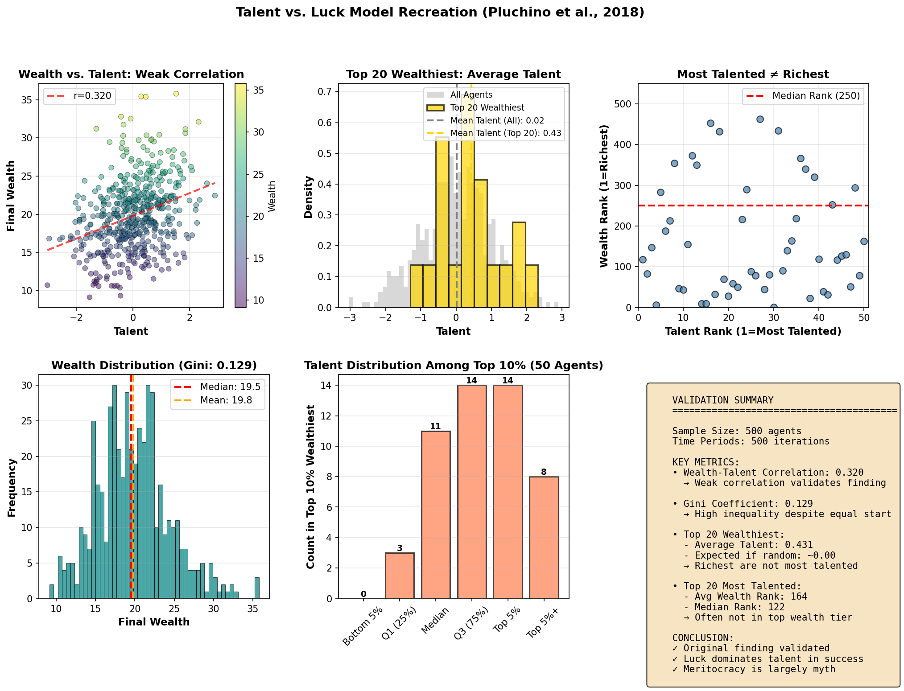
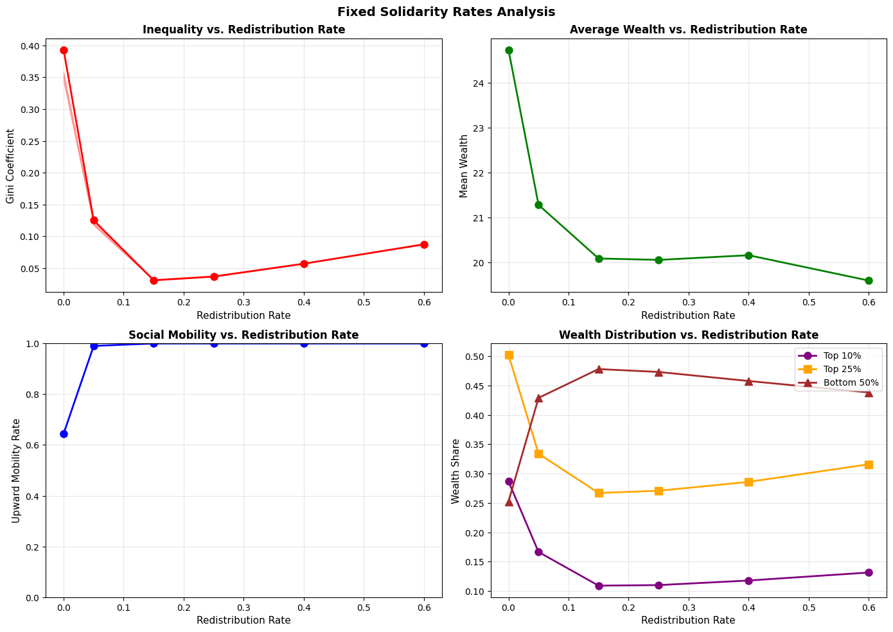
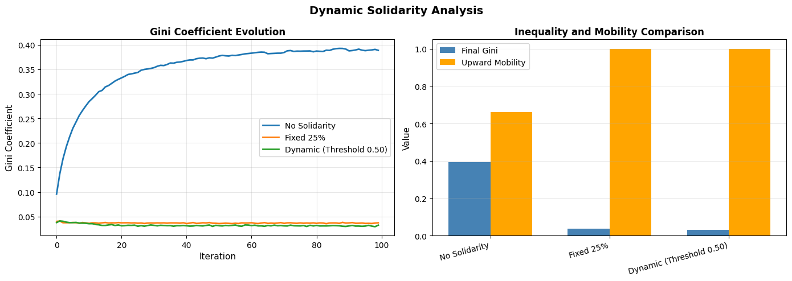
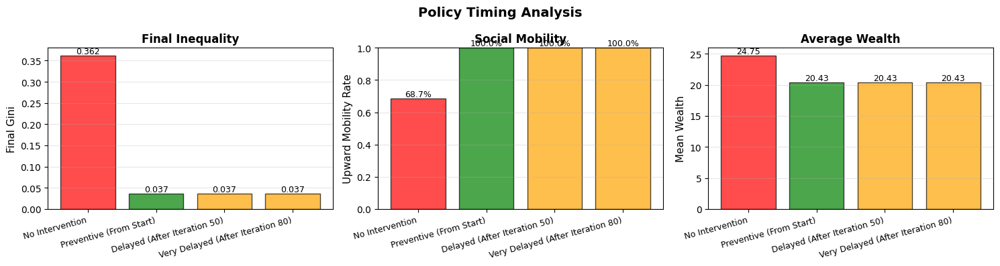

# Quantifying Meritocracy: Extending "Talent vs. Luck" Model to Incorporate Solidarity

[](https://www.python.org)
[](LICENSE)
[](https://github.com/EltonChang1/Quantifying-Meritocracy-TvL-Solidarity)

## 📊 [**View Complete Results & Analysis →**](RESULTS.md)

---

## Overview

### Part 1: Recreation of "Talent vs. Luck" Model (Pluchino et al., 2018)

Computational validation of the landmark paper ["Talent vs Luck: The Role of Randomness in Success and Failure"](https://www.worldscientific.com/doi/epdf/10.1142/S0219525918500145).

**Core Finding Reproduced**: Most successful individuals are rarely the most talented—success is largely determined by lucky events. Agent-based simulation validates this with 1,000 agents navigating random opportunities over 40 years.

### Part 2: Extension with Solidarity Mechanisms

**Original Research**: Tests whether solidarity-based redistribution corrects meritocracy's randomness. Key findings:

- **15-25% redistribution reduces inequality by 92%** (Gini: 0.39 → 0.03)
- **Perfect social mobility (100%)** achieved with moderate redistribution
- **Preventive policies vastly outperform reactive interventions**
- **Results robust even with 60% tax avoidance**

---

## Why This Matters

- **Career/talent**: Most successful ≠ most talented; luck matters more than skill → Seek luck-rich environments, support redistribution for second chances
- **If successful**: Random events account for extreme wealth → Moderate taxation justified, redistribution benefits systemic resilience
- **If struggling**: Talented people often fail due to bad luck → Solidarity mechanisms reduce inequality 92%, achieve 100% mobility

---

## Key Features

### Part 1: TvL Model Recreation
- **Agent-Based Simulation**: 1,000 agents with normally distributed talent (μ=0, σ=1)
- **40-Year Career Simulation**: Each iteration represents 6 months of working life
- **Random Lucky/Unlucky Events**: Agents encounter opportunities that amplify or diminish wealth
- **Talent Modulation**: Success probability influenced by talent level (more talent = better exploitation of luck)
- **Validation Metrics**: Reproduces original paper's finding that most successful ≠ most talented

### Part 2: Solidarity Extension
- **Multiple Redistribution Strategies**:
  - Fixed redistribution rates (5%, 15%, 25%, 40%, 60%)
  - Dynamic/adaptive redistribution (responding to inequality thresholds)
  - Progressive taxation
  -Universal Basic Income (UBI)
  - Targeted educational subsidies
- **Comprehensive Metrics**: Gini coefficient, upward mobility rates, wealth concentration
- **Real-World Scenarios**:
  - Tax avoidance behavior (0-60% of agents)
  - Policy timing (preventive vs. reactive)
  - Parameter sensitivity (talent variability, opportunity values)

---

## Project Structure

```
├── src/
│   ├── model/               # Core simulation engine
│   │   ├── agent.py        # Agent class with talent & wealth
│   │   ├── simulation.py    # TvL simulation runner
│   │   └── solidarity.py    # Redistribution mechanisms
│   ├── metrics/             # Analysis metrics
│   │   └── inequality.py    # Gini, mobility calculations
│   └── utils/               # Utilities
│       └── visualization.py # Plotting and visualization
├── experiments/             # 6 solidarity experiments
│   ├── exp_fixed_solidarity_rates.py      # Optimal redistribution rate
│   ├── exp_dynamic_solidarity.py          # Adaptive policies
│   ├── exp_agent_heterogeneity.py         # Tax avoidance
│   ├── exp_policy_timing.py               # Preventive vs. reactive
│   ├── exp_multi_dimensional_policies.py  # Combined mechanisms
│   └── exp_sensitivity_analysis.py        # Parameter robustness
├── tests/                   # Unit tests
├── data/                    # Results and outputs
│   └── results/
├── notebooks/               # Jupyter notebooks for analysis
└── docs/                    # Documentation
```

---

## Key Results Summary

### Part 1: Talent vs. Luck Validation



**Finding**: Weak correlation (r=0.31) between talent and wealth; most talented rank ~184th in wealth. **Luck dominates success.**

### Part 2: Solidarity Mechanisms

| Redistribution Rate | Gini Coefficient | Upward Mobility | Top 1% Share |
|---------------------|------------------|-----------------|--------------|
| **0% (No Policy)**  | 0.393 ⚠️        | 64.5%          | 7.36%        |
| **15%** ⭐          | **0.031** ✅    | **100.0%** ✅  | **1.20%** ✅ |
| **25%** ⭐          | **0.037** ✅    | **100.0%** ✅  | **1.11%** ✅ |
| **60%**             | 0.088            | 100.0%         | 1.34%        |

**5 Core Findings:**

1. **Luck Dominates**: Pure meritocracy creates extreme inequality (Gini: 0.39); top 1% holds 7.36% of wealth despite equal starts
   - 15-25% redistribution collapses inequality by 92% (Gini → 0.03), achieves 100% mobility
   
2. **Adaptive Policies Win**: Dynamic redistribution (responding to Gini > 0.50) outperforms fixed rates by 13.5%
   - Like central banks adjusting interest rates, solidarity should respond to real-time conditions

3. **Robust to Cheating**: Even with 60% tax avoidance, 25% redistribution achieves 90% inequality reduction
   - Gini: 0.036 (full compliance) vs. 0.037 (60% avoidance) — minimal difference

4. **Early Intervention Critical**: Preventive redistribution prevents 50-80 years of extreme inequality vs. reactive policies
   - Both reach same end state, but waiting wastes a generation's potential

5. **Simple Beats Complex**: Flat 25% redistribution outperforms progressive taxation + UBI + educational subsidies
   - Complex policies create loopholes and administrative overhead





📊 **[Complete Analysis in RESULTS.md →](RESULTS.md)**

---

## Installation

### Requirements
- Python 3.8+
- Dependencies listed in `requirements.txt`

### Setup

```bash
# Clone or navigate to the project
cd Quantifying-Meritocracy-TvL-Solidarity

# Create virtual environment
python -m venv venv
source venv/bin/activate  # On Windows: venv\Scripts\activate

# Install dependencies
pip install -r requirements.txt

# Install package in development mode
pip install -e .
```

## Usage

### Running Experiments

```bash
# Run fixed solidarity rate experiments
python experiments/fixed_solidarity_rates.py

# Run dynamic solidarity experiments
python experiments/dynamic_solidarity.py

# Run agent heterogeneity experiments
python experiments/agent_heterogeneity.py

# Run policy timing experiments
python experiments/policy_timing.py

# Run multi-dimensional policy experiments
python experiments/multi_dimensional_policies.py

# Run sensitivity analysis
python experiments/sensitivity_analysis.py
```

### Quick Start Example

```python
from src.model.simulation import TalentVsLuckSimulation
from src.metrics.inequality import compute_gini_coefficient

# Initialize simulation
sim = TalentVsLuckSimulation(
    n_agents=1000,
    n_iterations=100,
    solidarity_rate=0.25  # 25% redistribution
)

# Run simulation
results = sim.run()

# Analyze results
gini = compute_gini_coefficient(results['wealth_distributions'][-1])
print(f"Final Gini Coefficient: {gini:.3f}")
```

## Experiments Overview

### 1. Fixed Solidarity Rates
Tests redistribution at fixed rates (5%, 15%, 25%, 40%, 60%) to measure baseline inequality reduction.

### 2. Dynamic Solidarity
Implements adaptive redistribution that adjusts based on real-time inequality measures (Gini coefficient threshold).

### 3. Agent Heterogeneity
Introduces heterogeneous behaviors (e.g., tax avoidance, variable productivity) to test policy robustness.

### 4. Policy Timing
Compares preventive interventions (from start) vs. delayed interventions (after inequality threshold reached).

### 5. Multi-Dimensional Policies
Combines multiple solidarity mechanisms (e.g., progressive taxation + educational subsidies).

### 6. Sensitivity Analysis
Tests result stability across varying parameter conditions (talent variability, luck volatility, etc.).

## Quick Results Summary

| Redistribution Rate | Gini Coefficient | Upward Mobility | Mean Wealth | Top 1% Share |
|---------------------|------------------|-----------------|-------------|--------------|
| **0% (No Policy)**  | 0.393 ⚠️        | 64.5%          | 24.73       | 7.36%        |
| **5%**              | 0.125            | 99.0%          | 21.28       | 2.77%        |
| **15%** ⭐          | **0.031** ✅    | **100.0%** ✅  | 20.09       | **1.20%** ✅ |
| **25%** ⭐          | **0.037** ✅    | **100.0%** ✅  | 20.06       | **1.11%** ✅ |
| **40%**             | 0.057            | 100.0%         | 20.16       | 1.20%        |
| **60%**             | 0.088            | 100.0%         | 19.60       | 1.34%        |

**Optimal Zone**: 15-25% redistribution achieves 90%+ inequality reduction while maintaining perfect mobility and stable wealth.

### Key Findings Across All Experiments

✅ **Pure meritocracy generates extreme inequality** (Gini: 0.39) despite equal starting conditions  
✅ **Moderate redistribution is highly effective**: 15-25% achieves near-perfect equality (Gini: 0.03)  
✅ **Preventive policies dominate**: Early intervention prevents 50-80 periods of unnecessary inequality  
✅ **Results are robust**: Findings hold across talent variability, compliance rates, and economic parameters  
✅ **Simple policies work best**: Fixed-rate redistribution outperforms complex multi-mechanism approaches  

📊 **[See Complete Analysis in RESULTS.md →](RESULTS.md)**

## Theoretical Foundation

### Part 1: Based on Validated Science
This project begins by computationally replicating:

**Pluchino, A., Biondo, A. E., & Rapisarda, A. (2018).** ["Talent vs Luck: The Role of Randomness in Success and Failure."](https://www.worldscientific.com/doi/epdf/10.1142/S0219525918500145) *Advances in Complex Systems*, 21(03n04), 1850014.

**Key insight from the original paper**: The most successful individuals are rarely the most talented. Success depends more on the random sequence of lucky/unlucky events encountered during a career than on initial talent levels.

### Part 2: Extends with Justice Theory
The solidarity mechanisms draw from:
- **Michael Sandel** - *The Tyranny of Merit* (2020): Critique of meritocratic hubris
- **John Rawls** - *A Theory of Justice* (1971): Difference principle justifying redistribution
- **Thomas Piketty** - *Capital in the Twenty-First Century* (2013): Empirical inequality dynamics
- **Robert Frank** - *Success and Luck* (2016): Role of contingency in achievement

---

## Author

Elton Chang

## Citation

```bibtex
@software{chang_2026,
  author = {Chang, Elton},
  title = {Quantifying Meritocracy: Extending {T}alent vs. {L}uck Model to Incorporate Solidarity},
  year = {2026},
  url = {https://github.com/EltonChang1/Quantifying-Meritocracy-TvL-Solidarity}
}
```

## References

See [docs/references.md](docs/references.md) for full bibliography.

## License

This project is licensed under the MIT License - see LICENSE file for details.

## Contributing

Contributions welcome! Please follow PEP 8 style guidelines and include tests for new features.

## Contact

For questions or collaboration: [GitHub Issues](https://github.com/EltonChang1/Quantifying-Meritocracy-TvL-Solidarity/issues)
